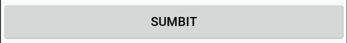

# Basic Android Widgets

Each UI element you see on your Android Screen is a component of view Class, be it a Button, TextView etc. So, for example, a Button you see on your screen is defined in a class Button which extends from a class View.

There are two ways to populate UI elements on the screen.
* Your application can create UI elements (and manipulate their properties) programmatically at runtime.

* Defining UI elements in an XML file. The name of the tag is same as the name of the class of the particular view. The advantage to declaring your UI elements in XML is that it enables you to better separate the presentation of your application from the code that controls its behaviour.


In XML, we start each element with '<' followed by name of a class that extends a  View Class. Views like Button, EditText are defined inside OS, therefore, we don't have to specifically give a path to the class, we can use 'Button', 'EditText' etc. After defining the UI element we necessarily have to define some attributes like element's height, width. And we can define some more attributes as per our need. The value for each attribute must be given in double quotes.

Special Views which can have multiple views inside them are known as ViewGroups. Example layouts which contain these UI elements. We will talk about them in a separate article.


There are some attributes which are common to each and every view defined in android. These are -

**android:id**

  This attribute is used to declare a unique id for the particular element. The view can be referenced in code using this id like findViewById(R.id.givenId)(It returns a reference to the button). It is better to start id value with the name of the type of UI element. Example, in case of Button we can have id start with 'btn' so we can easily identify button ids in our code.

  **android:layout_height**

  This tag is used to define the height of a widget. It can have three different values 'match_parent', 'wrap_content' or custom size.
  * match_parent means to take the full height of the parent layout.

  * wrap_content means that the view wants to be just big enough to enclose its content (plus padding)
  * Custom size can be in any unit like sp, dp(density-independent pixel), px(pixel). But in Android, it preferred to use dp as the size is independent of the screen pixel and can remain constant on different screens.

  **android:layout_width**

  This tag is used to define the width of a widget. It can be 'match_parent', 'wrap_content' or custom size.
  * match_parent means to take the full width of the parent layout.

  * wrap_content means that the view wants to be just big enough to enclose its content (plus padding)
  * Custom size can be in any unit like sp, dp(density-independent pixel), px(pixel). But in Android, it preferred to use dp as the size is independent of the screen pixel and can remain constant on different screens.

  Use of the above attributes will become more clear when we go through specific examples below.


  #### Button

  A user interface element the user can tap or click to perform an action.

  To display a button in an activity, add a button to the activity's layout XML file:

  ```xml
  <Button
      android:id="@+id/btnSubmit"
      android:layout_height="wrap_content"
      android:layout_width="wrap_content"
      android:text="Submit" />         
  ```

  id of the above declared button in XML is 'btnSubmit'. We can reference this button in our code using findViewById(R.id.btnSubmit)

  Height and width of the button is wrap content.

  * android:text

    This attribute contains the text which needs to be displayed inside the button.

  Button with width 'wrap_content'
  

  Button with width 'match_parent'
  

#### Textview
TextView is a widget in android to display plain text.

```xml
<TextView
        android:id="@+id/tvSomeText"
        android:layout_width="wrap_content"
        android:layout_height="wrap_content"
        android:text="Hey there"
        android:textColor="@android:color/black"
        android:textSize="12sp"
        android:textStyle="bold" />
```

#### EditText

```xml
<EditText
      android:id="@+id/etName"
      android:layout_width="match_parent"
      android:layout_height="wrap_content"
      android:ems="10"
      android:hint="Name"
      android:inputType="textPersonName" />
```
#### ImageView

```xml
<ImageView
        android:layout_width="wrap_content"
        android:layout_height="wrap_content"
        android:src="@mipmap/ic_launcher"
        android:scaleType="fitXY"/>
````
